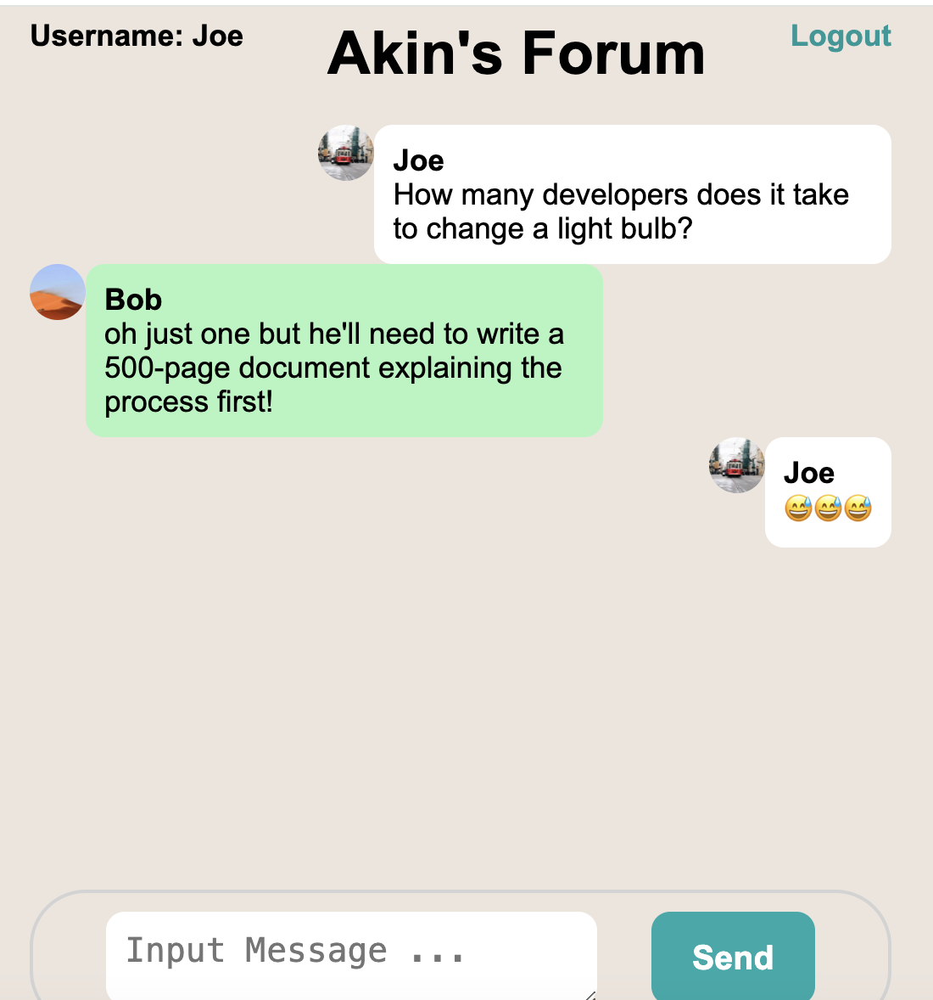

## Description

This is a fullstack real-time chat applicaiton utilizing React (Vite), Node.js, Express, Socket.io, MongoDB (in docker), and Swagger API documentation while utilizing Typescript. There are also server integration tests and client e2e tests.  

## Installation

```bash
cd server
npm install
# change terminal
cd client
npm install
```

## Running the app

```bash
# start database
docker compose up --build -d
# start server
cd server
npm start
# start client
cd client
npm run dev
```
- database ui will be running on `http://localhost:8081` [http://localhost:8081](http://localhost:8081)
- client will be running on `http://localhost:5173` [http://localhost:5173](http://localhost:5173)

- Note: the login screen only requires entering a unique name so that you can be identified in the chat room


## Testing
#### prerequisites
- for both integration tests and e2e tests db, and server and client should all be running

```bash
# run backend integration tests
$ cd sever
$ npm run int-test
# run frontend e2e tests
$ cd client
$ npm run e2e-test
```

## Documentation
swagger: [http://localhost:3002/api-docs](http://localhost:3002/api-docs)


## License
[MIT licensed](LICENSE).
